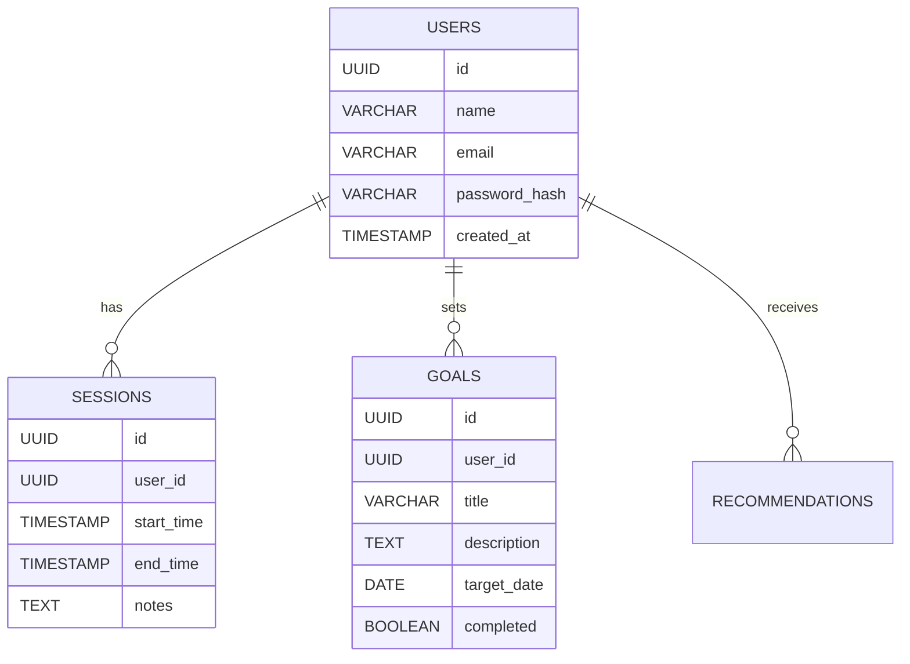
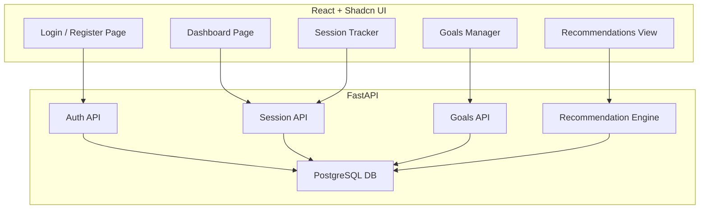

# Learning Management 

A productivity tracking web application designed for students and professionals who want to monitor their study or work sessions, set personal goals, and receive AI-powered recommendations to improve focus and habits.

## Installation

Clone this repository
```bash
    git clone https://github.com/Angel2113/LearningManagement
```

## Usage 






